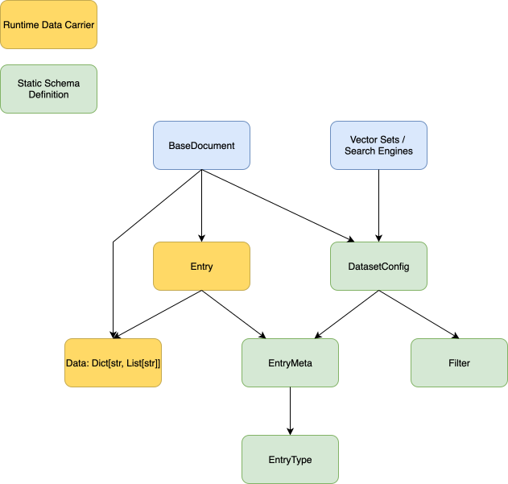
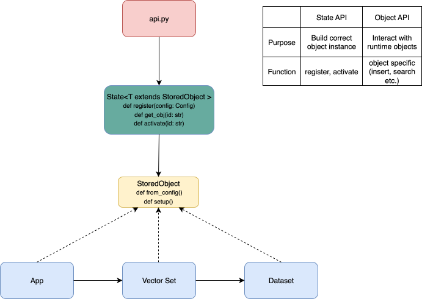
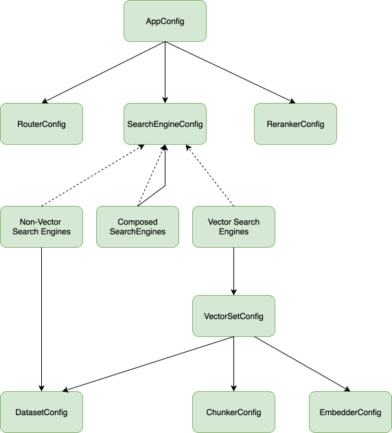
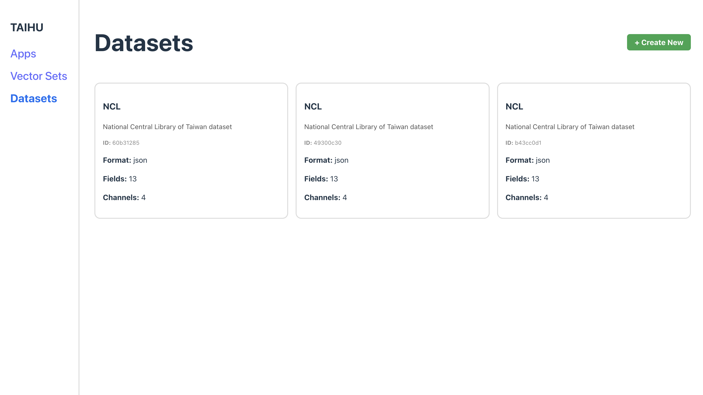
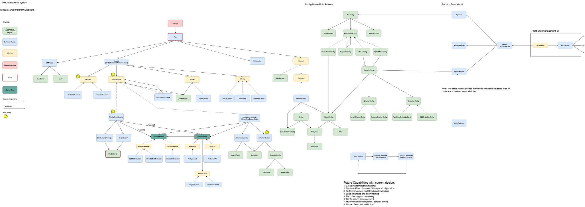

# SearchGym: A Modular Platform for RAG System Design
See SETUP.md for setup instructions. 
## Introduction

Frameworks like **LangChain** and **Haystack** provide toolkits for building retrieval-augmented generation (RAG) systems. However, what truly bridges the gap between toy examples and production-level systems is not just toolkits or utility functions—it’s architecture.

**SearchGym** is a platform architecture that guides system designers through the key design decisions involved in building robust academic document search systems. Using the interfaces and abstractions provided by SearchGym, one can flexibly combine the strengths of multiple toolkits and orchestrate them into a production-ready pipeline.

---

## The Design Space of RAG Systems: Who, What, and How

In semantic academic document retrieval, state-of-the-art deep learning models transform text into vector embeddings that encode semantic meaning. These vectors are then indexed and queried using various search backends.

However, real-world scenarios often require more than simple vector similarity. Complex search demands arise when structured filters (e.g., author, date, topic) need to be integrated with semantic search. Existing tools excel in different areas—**Milvus** specializes in vector similarity, while **Elasticsearch** supports rich structured queries. 

**SearchGym** sits at a higher level of abstraction, allowing users to explore and combine these tools flexibly and systematically.

---

## Three Core Components: Dataset, Vector Set, App

SearchGym offers a **simple yet generalizable architecture** to support any document retrieval system configuration. The three central stateful components are:

### 1. Dataset — _How do we represent a document?_

Documents often contain both structured and unstructured information. Multiple text snippets may represent a document’s meaning: title, abstract, body sections, or even an LLM-generated summary. In parallel, structured fields (like authorship, date, or domain tags) must be captured in a flexible, filterable schema.

SearchGym separates the **dataset schema** (static metadata) from the **document instance** (runtime content). A dataset is defined in terms of:
- **Channels**: unstructured textual views of a document.
- **Metadata**: structured fields for filtering and categorization.

This separation ensures that once the dataset is defined, any search architecture above it can operate smoothly.

---

### 2. Vector Set — _How do we turn documents into vectors?_

Once a document is represented, the next decision is how to embed it.

Key questions include:
- What model should be used?
- Should the document be represented by one vector or multiple?
- How do we chunk long documents into manageable pieces?

A **Vector Set** in SearchGym is defined by:
- A target **Dataset**
- A **Channel** to encode
- An **Embedder** (model)
- A **Chunking strategy**

This modular approach allows experimentation across different embedding models and document segmentation strategies.

---

### 3. App — _How do we search, route, and rerank?_

With vectors in place, we can index them using different search engines. Some tools, like Milvus, handle only vectors; others, like Elasticsearch, work with structured metadata alone.

An **App** in SearchGym defines:
- A collection of **Search Engines** (vector-based, structured, or hybrid)
- A **Router**, which decides which engines to query
- A **Reranker**, which refines the final results

An app is a fully functional version of the system. Within it, 
routers can route based on query type, filter presence, or even runtime conditions like compute availability. This setup supports adaptive and scalable retrieval strategies.

---

## Config-Driven Development

All of the above components and design decisions are captured in a strongly typed configuration system.

SearchGym introduces a compositional **config algebra** that encodes valid combinations of design choices. This config schema:
- Mirrors the modular architecture
- Ensures valid and reproducible system definitions
- Enables fast experimentation and deployment

---

## No-Code Management UI

SearchGym includes a no-code **Management UI** that enables users to visually explore, compose, and launch full-stack search systems—without writing a single line of code.

This frontend interfaces directly with the stateful backend and allows:
- Creating datasets, vector sets, and apps
- Modifying configurations
- Triggering deployments or evaluations

---

## The Full System

The full architecture ties together:
- A **config-driven build process** for system reproducibility
- A **state API** that allows registration, lookup, and activation of system components
- A **functional runtime** that executes search operations via registered components

We’ve implemented representative backends to demonstrate the system’s flexibility:
- **Milvus** for vector-based search
- **Elasticsearch** for structured filtering
- Future support for rerankers, ensemble methods, and parallel search routing is planned

---
## Future Directions

SearchGym enables each app instance to be linked to a dedicated logging dashboard—integrated with third-party tools like **Weights & Biases Weave**. This allows for seamless tracking of queries, retrieval results, and user feedback in association with the specific app configuration.

With this infrastructure in place, platform managers can:
- Aggregate usage data and user satisfaction signals.
- Identify queries or scenarios where the system underperformed.
- Curate targeted benchmarks from these cases.
- Systematically evaluate new app versions on real-world failure cases.

This closes the loop between **deployment, monitoring, and improvement**, making continuous evaluation and self-improving systems a natural outcome of the SearchGym architecture.
 

## Final Notes

SearchGym is designed to grow with your needs. Its modular, typed, and runtime-aware architecture supports:
- Academic reproducibility
- Industrial-scale search orchestration
- Teaching and rapid prototyping

Let the design drive the system. With SearchGym, you’re not tied to a single backend or pipeline—you’re free to explore the full design space of semantic and structured document retrieval.
